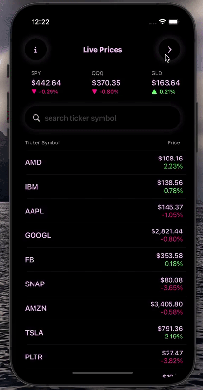

# ValueIvestorIOS
This project is a portfolio management tacking app that allows the user to add Stocks and Options to their portfolio.  

This app uses different IOS frameworks and principles like:
- MVVM
- Combine
- Core Data
- SwiftUI
- REST API (Yahoo Finance API & EOD Historical Data API)
- Custom UI
-----------------

